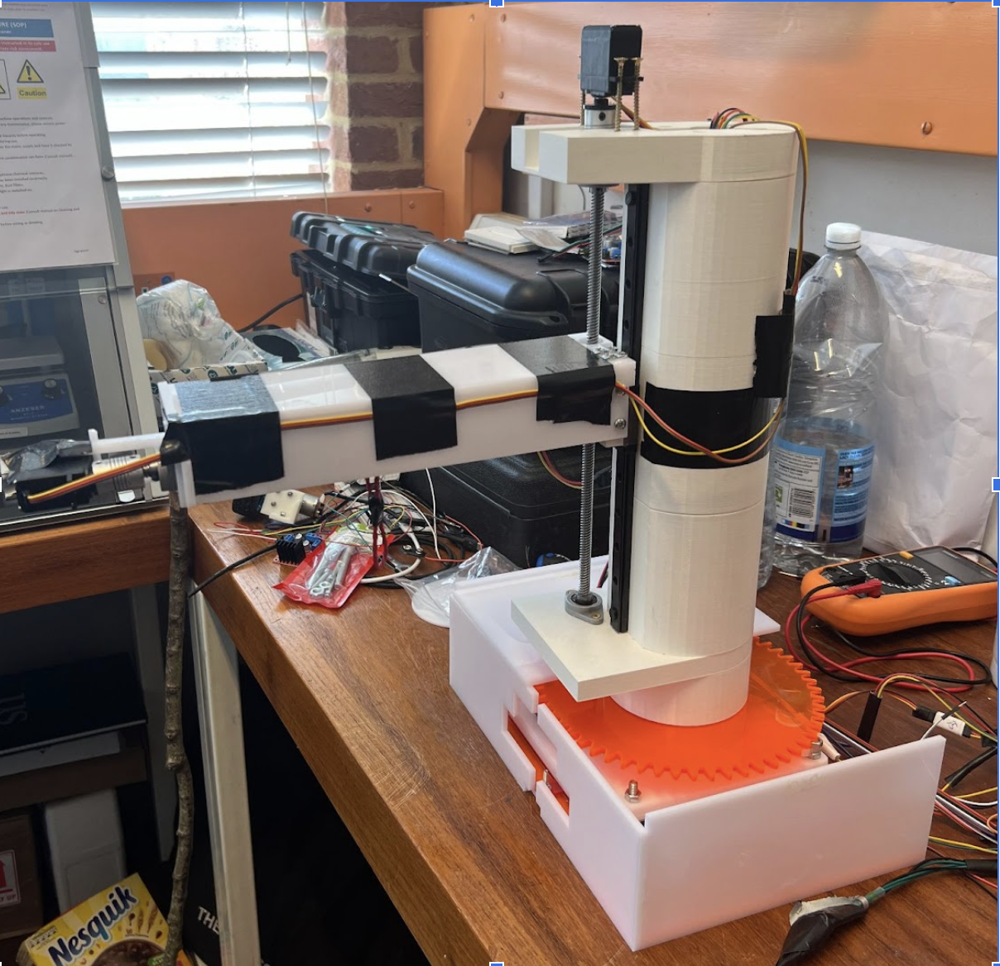
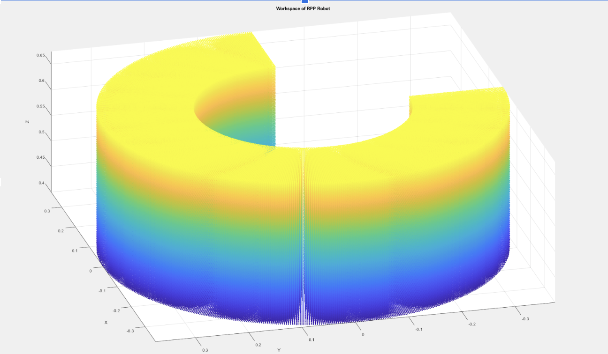

# RPP Picker Robot

**A 3-DOF Gantry-Style Pick-and-Place Robot**

---

## Overview

This repository contains the firmware and documentation for the **RPP Picker Robot**, a three-degree-of-freedom (Revolute–Prismatic–Prismatic) gantry-style robot designed for hook pick-and-place operations. The primary contribution of this project is the **closed-loop bang–bang (on–off) control algorithm** implemented on an Arduino platform, coupled with modular C++ code for kinematics, task sequencing, and encoder feedback. This project was made for the Robotics Implementation and Design course at the University of Sussex, UK

<table>
  <tr>
    <td></td>
    <td></td>
  </tr>
</table>

> **Image and Video of the RPP Picker Robot in operation** 

---

## Table of Contents

1. [Features](#features)  
2. [Control Algorithm](#control-algorithm)  
3. [Code Structure](#code-structure)  
4. [Installation & Upload](#installation--upload)  
5. [Usage](#usage)  
6. [Collaborators](#collaborators)  
7. [References](#references)  

---

## Features

- **3-DOF RPP mechanism**: One revolute joint (rotation about Z) and two prismatic joints (vertical lift and radial extension). Uses continuous servos for all joints  
- **Closed-loop bang–bang control**: On–off feedback using rotary encoders for precise joint positioning.  
- **Waypoint-based path planning**: Predefined joint-space waypoints with dwell times for reliable pick-and-place.  
- **EEPROM persistence**: Automatic saving and loading of encoder positions to retain zero references across power cycles.  

### Workspace



---

## Control Algorithm

At the heart of the RPP Picker Robot is a simple yet effective **bang–bang (on–off) controller** for each joint:

1. **Error Calculation** 
<pre>
`eᵢ = targetPositionᵢ - currentPositionᵢ`
</pre>
   where `currentPosition_i` is read from the joint’s encoder.

2. **On–Off Drive**  
   &emsp; - If `(|e_i| > tolerance_i\\)`, drive the servo at full speed in the direction of the error (CW or CCW).  
   &emsp; - If \\(|e_i| \\le tolerance_i\\), command the servo to neutral (stop).

3. **Dead-Band & Dwell**  
   &emsp; - Once within tolerance, hold the position for a short **settle time** (e.g., 100 ms) before declaring the joint “at target.”  
   &emsp; - Scheduled **dwell times** at pick-and-place waypoints ensure stable gripper operation.

4. **Task Sequencing**  
   &emsp; - Advance to the next waypoint only after **all** joints are within tolerance and settled.  
   &emsp; - Supports multi-step pick-and-place routines (e.g., approach, grasp, lift, move, release, retract).

---

## Code Structure

```text
src/
├── config.h           # Global constants, structs, externs
├── config.cpp         # Definitions of globals (joint array, constants)
├── encoder.h/.cpp     # Interrupt-driven encoder handling
├── ServoControl.h/.cpp# Bang–bang joint control implementation
├── EepromManager.h/.cpp # EEPROM save/load for encoder zero positions
├── IK.h/.cpp          # Inverse Kinematics calculations
├── TaskRunner.h/.cpp  # Waypoint sequencing and dwell logic
├── Parser.h/.cpp      # Serial command parsing (Direct & IK modes)
└── main.cpp           # setup() & loop() wiring everything together

```
---

## Usage

- **Power on the robot**; it will auto-home all joints and prompt:

```
Select operation mode:
  D - Direct joint control
  I - Inverse kinematics control
```

- **Direct mode (D)**: send `J1,J2,J3\n ` over serial to command joint positions (e.g., 90,50,30).
- **IK mode (I)**: send `X,Y,Z\n` to command Cartesian positions (e.g., 100,50,20).
- **Task Sequence**: send `TASK\n` to run the predefined pick-and-place routine.

## Collaborators

- Eren Irdiren
- Thomas W Humphrey